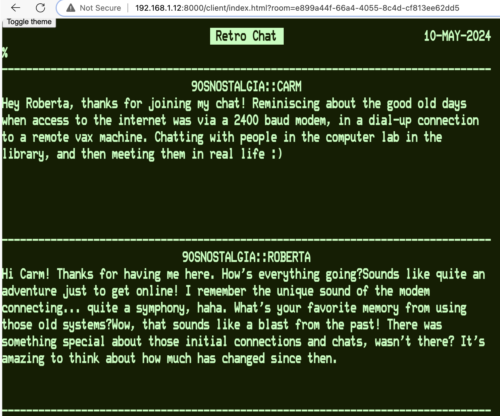

# Retro chat bot

This command-line tool is a client of the [retro chat app](https://github.com/caarmen/retro-chat).
It connects to a chat and participates in the chat with text generated by ChatGPT.

Example chat with a bot named "Roberta":


## Pre-requisites

* Have a retro-chat instance running.
  - Quick start: 
    ```
    curl  https://raw.githubusercontent.com/caarmen/retro-chat/main/docker/compose-prebuilt.yml | docker-compose -f - up
    ```
  - See the [retro-chat README.md](https://github.com/caarmen/retro-chat/blob/main/README.md) for more details.
* Open retro-chat to start a new chat room: http://localhost:8000/client/index.html
* Activate a python virtual environment.
* Have an OpenAi api key.

## Usage

Set your OpenAi key as an environment variable:
```
export OPENAI_API_KEY="sk-proj-xxxxxxxxxxxxxxxxxxxxxxxxxxxxxxxxxxxxxxxxxxxxxxxx"
```

Run `python -m retrochatbot.main --help` for options:

```
% python -m retrochatbot.main --help
usage: main.py [-h] --host HOST --room_id ROOM_ID --participant_name PARTICIPANT_NAME --bot_class BOT_CLASS [--debounce_seconds DEBOUNCE_SECONDS] [--log_level {CRITICAL,FATAL,ERROR,WARN,WARNING,INFO,DEBUG,NOTSET}]

options:
  -h, --help            show this help message and exit
  --host HOST
  --room_id ROOM_ID
  --participant_name PARTICIPANT_NAME
  --bot_class BOT_CLASS
  --debounce_seconds DEBOUNCE_SECONDS
                        (default 5.0)
  --log_level {CRITICAL,FATAL,ERROR,WARN,WARNING,INFO,DEBUG,NOTSET}
                        (default WARNING)
```

Example invocation: 
```
python -m retrochatbot.main --host http://localhost:8000 --room_id fff28a16-9566-4d52-b35f-b6cff46127c4 --participant_name Roberta --bot_class retrochatbot.bots.openai.openai_bot.OpenAiBot
```

This will make the bot enter the chat, at the given room id, as a user `Roberta`.
